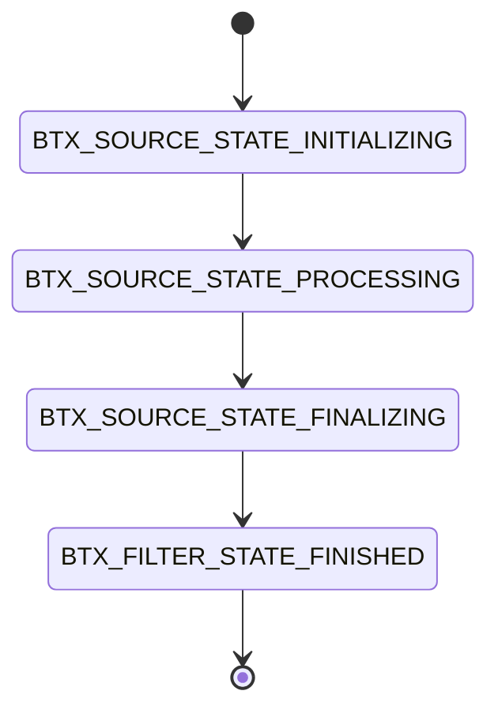
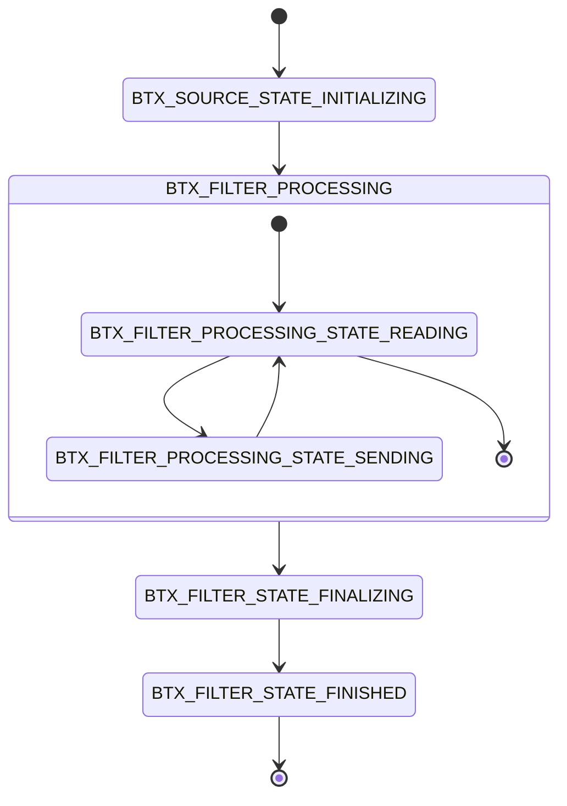

# What symbols to provide?

## Filter & Sink

Link with a object file who export the symbol `btx_register_usr_callbacks(void *)`.

The implementation of `btx_register_usr_callbacks` should conssist of calls to `btx_register_callbacks_#{stream_class_name}_#{event_class_name}(btx_handle, &callbacks)`.

## Source:

Link with a object file who export the symbol `btx_push_usr_messages(struct xprof_common_data *common_data)`.

# Function Provided

## Source & Filter
	
In the callbacks, and in the `btx_push_usr_messages`, you have access to `btx_push_message_{stream_class_name}_#{event_class_name}(struct xprof_common_data *common_data, ...)`.

# Source Description

## State Machine

# Filter Description

## State Machine

# Sink Description

At finalization we will call the `btx_user_finalization(struct xprof_common_data *common_data)`

