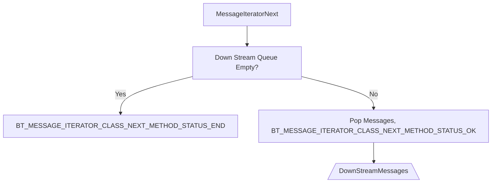
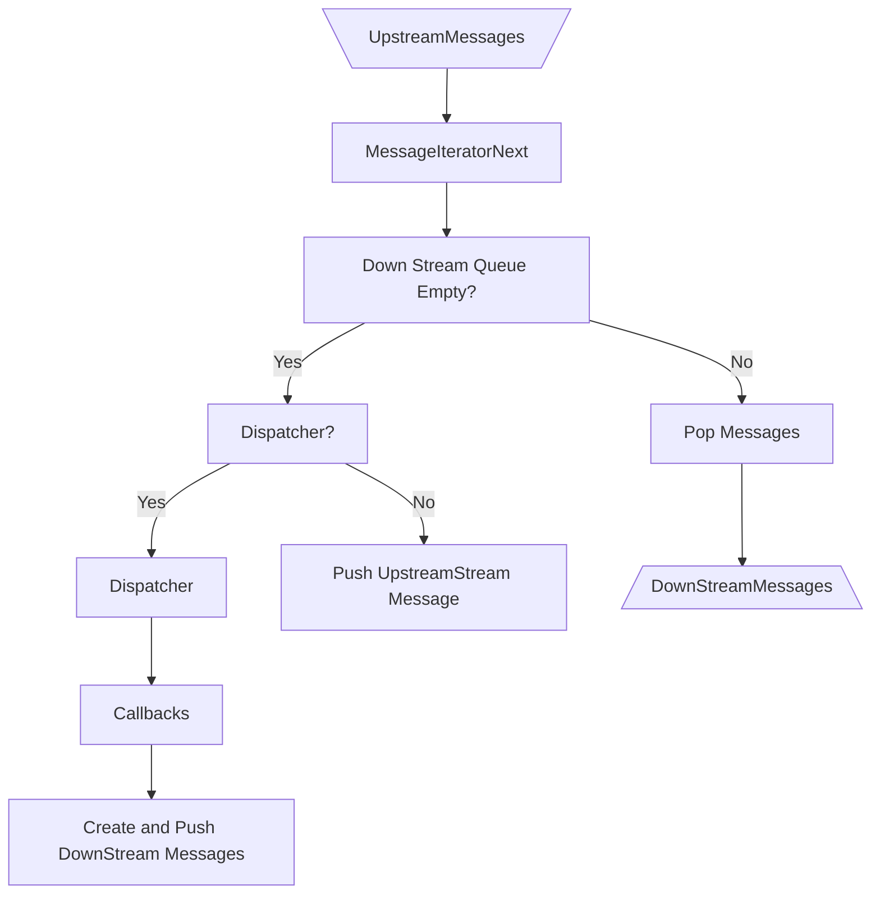
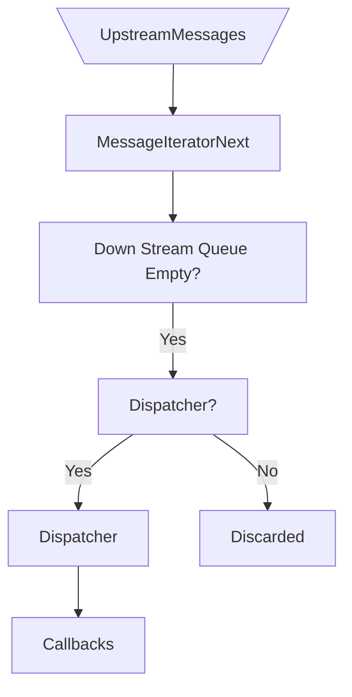

## Filter & Sink

Need to link with a object file who export the symbol `btx_usr_register_callbacks(btx_name_to_dispatcher_t** name_to_dispatcher)`. The implementation of `btx_usr_register_callbacks` should conssist of calls to `btx_register_callbacks_#{stream_class_name}_#{event_class_name}(name_to_dispatcher, &callbacks)`.

## Source:

Need to with a object file who export the symbol `btx_push_user_messages(struct xprof_common_data *common_data)`.

## Source  & Filter
	
In the callbacks, and in the `btx_push_user_messages`, you have access to `btx_push_message_{stream_class_name}_#{event_class_name}(struct xprof_common_data *common_data, ...).

# Source Description

At initialization, we push messages to the downstream queue. 

1. `btx_push_messages_stream_beginning`
2. `btx_push_user_messages`
3. `btx_push_messages_stream_end`

# Filter Description

# Sink Description

At finalization we will call the 
`btx_user_finalization(struct xprof_common_data *common_data)`

