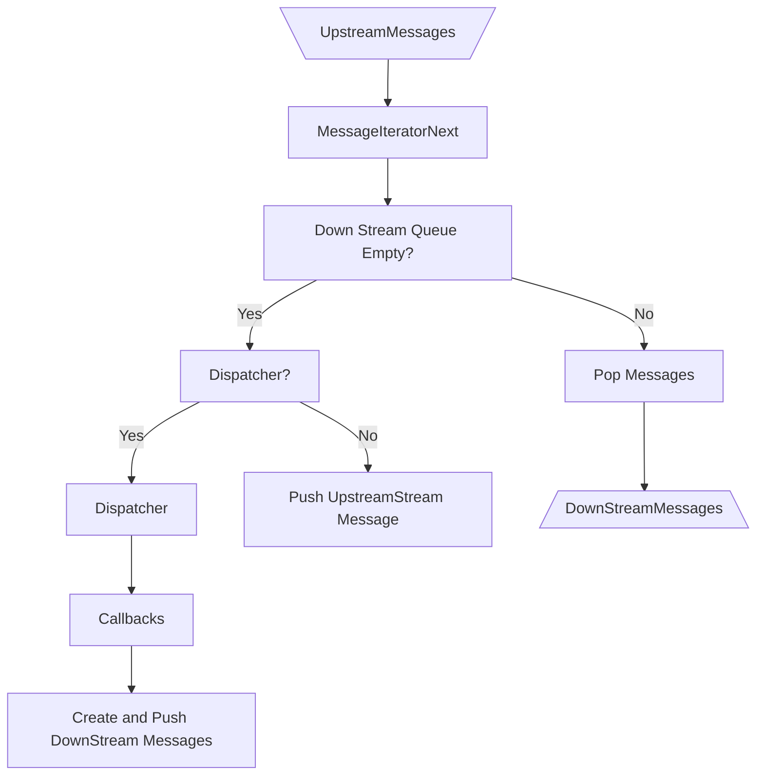

```mermaid
graph TD
    UM[\UpstreamMessages/] --> M[MessageIteratorNext] 
    M --> MTP[Down Stream Queue Empty?]
    MTP -- Yes --> D?[Dispatcher?]
    D? -- Yes --> D[Dispatcher]
    D? -- No --> PUS[Push UpstreamStream Message]
    D --> Callbacks
    Callbacks --> CPD[Create and Push DownStream Messages]
    MTP -- No --> PM[Pop Messages]--> DS[/DownStreamMessages\]
```
